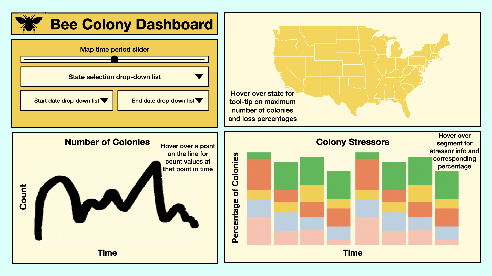

# Bee Colony Dashboard

The Bee Colony Dashboard will feature three different plots and four different widgets. The first plot is a geographic map of the United States of America. The user will be able to adjust the time period (measured by quarters of a year) that they are looking at by using a slider. By hovering over a state, the user will obtain the maximum number of colonies for that time period as well as the colony loss percentage, measured as the number of lost colonies divided by the maximum number of colonies in that time period. The second plot is a time series plot of the number of colonies of a single state as it varies over a specified period of time. The third plot is a time series bar chart of the percentage colonies being affected by different types of colony stressors in a single state, as it varies over a specified period of time. Both the second and third plots are controlled using the same three drop-down lists. The first drop-down list allows the user to select a state that they wish to visualize the data for. The other two drop-down lists will control the start and end of the time period, respectively.

